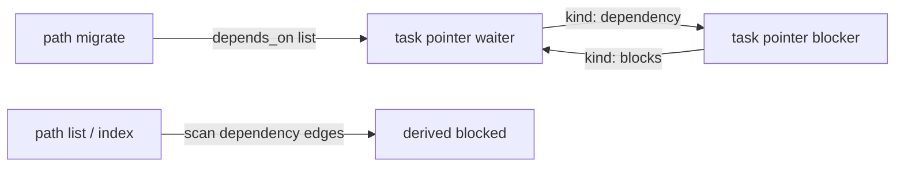

## Intent

Unify task waits with the Atlas graph: remove the dedicated `depends_on: []` field and express a wait such as “T16 *Publish release notes* waits on T15 *Tag release candidate*” as `relates_to` edges — waiter **`kind: dependency`**, blocker **`kind: blocks`** — with skill dual-write sync. Derive list/index **blocked** from the waiter’s `kind: dependency` targets using the v0.2 terminal rule. Fail closed unless targets are same-Atlas `type: task` pointer paths. Ship as the next breaking cut after **atlas-tasks v0.3.0** rename (likely **v0.4.0**).

## Change-class

`new-surface`

## work_id

`2026-09-29-atlas-tasks-depends-relates-to` (inherited; validated)

## Discuss orbit

`work/2026-09-29-atlas-tasks-depends-relates-to/` (hub, problem write-up and pins)

## Objective

Design only; persist plan; work → `designed`; **stop for approval**. Do not implement until approved **and** rename publish gate is satisfied (or the maintainer waives it).

## Scope (implement only after explicit approval)

1. **Contract**
   - Remove all skill/docs/smokes that require or write `depends_on`
   - Waiter: `relates_to: [{ path: <task-pointer>, kind: dependency }]`
   - Blocker: dual-write `relates_to: [{ path: <waiter-pointer>, kind: blocks }]`
   - Cycles forbidden; skill sync on add/update/clear
2. **Targets**
   - Same-Atlas `type: task` **pointer** paths only; reject task bodies, non-task reference pages (e.g. reviewer notes, sign-off records) and cross-Atlas targets
3. **Derived blocked**
   - From waiter `kind: dependency` targets: blocked iff any target `task_status` ∈ {`open`,`in_progress`}; `done`/`cancelled` clear; no `task_status: blocked`; no boolean field
4. **Paths**
   - Update add / update / list / complete / help / getting-started / migrate
   - Migrate: convert `depends_on: [task_id]` → path edges + reverse `blocks`; drop `depends_on` key
5. **Version**
   - Bump package to **0.4.0** (breaking) unless the maintainer chooses otherwise at implement time
6. **Evaluation**
   - Rewrite smoke `depends-on-*` → dependency-edge smokes
   - New `references/scenarios/atlas-tasks-adversarial-v2.yaml` (keep v1)
7. **Consumers**
   - Post-publish: consumer Atlases migrate existing `depends_on` lists (e.g. T16→T15) to dependency/blocks edges via the migrate path

## Non-goals

- Changing assignee / parent / sub_tasks contracts
- Storing `blocked_by` as a field
- Making non-task reference pages (reviewer notes, sign-off records) into dependency targets; such waits stay prose
- Cross-Atlas dependency edges
- Implementing before approval
- GitHub repo rename / v0.3.0 tag (separate ship track)

## Genesis Artifacts

### Intent + scope + non-goals

See above. Cost: **lean** instruction-first; dual-write mirrors existing parent/`sub_tasks` pattern.

### Component diagram



### Interface sketch

- Write: add/update accept dependency targets as pointer paths (or resolve `task_id` → pointer path once, then store path)
- Read: list shows `blocked` from dependency kinds; optional `blocks` column from reverse edges
- Fail closed: unknown/non-task/cross-Atlas/cycle

### Cost note

Single implement PR on atlas-tasks; smoke seconds; no panel.

## SOLID principles for skills

| Principle | Status | Rationale / design consequence |
|---|---|---|
| S | applicable | Skill still owns Atlas task discipline; dependency is graph semantics, not a second link system. |
| O | applicable | Breaking 0.4.0 closes `depends_on` writes; extension via declared `relates_to` kinds. |
| L | not-applicable | No claim that `depends_on` and `kind: dependency` are interchangeable after cut. |
| I | applicable | Paths expose only dependency/blocks write surface callers need; migrate is progressive disclosure. |
| D | applicable | Depend on Atlas `relates_to` + `type: task` contracts, not a parallel id-list ADT. |

## Catalogue Review

`catalogue_review: n/a` — edge-model change on existing INLINE HYBRID skill; no fan-out/gate redesign.  
`pattern_applicability: not-applicable` · `pattern_admission: not-selected`  
Composition remains **INLINE** (reuse dual-write pattern already in parent/`sub_tasks`).

## Challenge summary

1. **Agents still write `depends_on`** → accept: hard remove + migrate + smoke reject field; docs forbid.
2. **`kind: dependency` to non-task pages (reviewer notes, sign-off records)** → accept: fail closed to task pointers only (pinned).
3. **Dual-write drift** → accept: same sync rules as parent/`sub_tasks`; smoke both ends.
4. **Partial migrate (path without reverse)** → accept: migrate path writes both; update fail-closed if divergent.
5. **Cancelled still “feels” blocking** → reject as scope: keep v0.2 terminal clear rule (pinned/defaulted).

## Pinned decisions

1. Remove `depends_on`; only `relates_to` `kind: dependency` (+ migrate)
2. Dual-write reverse on blocker
3. Reverse kind = **`blocks`**
4. Targets = same-Atlas task pointer paths only
5. Derived blocked from `kind: dependency` with v0.2 terminal rule

## Challenge-success criteria

C1–C5 met; change-class `new-surface`; Genesis Artifacts complete.

## Behavioural contract (agent-spec)

`deferred: agent-spec not available in harness; Gherkin deferred`

## Evaluation plan

| Check | Expect |
|---|---|
| No `depends_on` in required contract samples | absent |
| Dual-write dependency/blocks | both ends match after set/clear |
| Fail closed non-task target | reject |
| Derived blocked | yes iff any dependency target open\|in_progress |
| Adversarial v2 | red if `depends_on` still canonical |

## Adversarial scenario draft

`references/scenarios/atlas-tasks-adversarial-v2.yaml`

```yaml
id: atlas-tasks-adversarial-v2
work_id: 2026-09-29-atlas-tasks-depends-relates-to
packages: [atlas-tasks]
adversarial: true
smokes:
  - id: no-depends_on-field
    source: remove-depends-on-pin
    expect: skill/docs do not require depends_on
  - id: non-task-dependency-rejected
    source: targets-pin
    expect: kind:dependency to a non-task page or task body fails closed
  - id: dual-write-blocks
    source: dual-write-pin
    expect: blocker gains kind:blocks when waiter gains dependency
  - id: blocked-from-dependency-edges
    source: derived-blocked-pin
    expect: list blocked derives from kind:dependency not depends_on
```

## Implement gate

1. Explicit approval of this plan
2. Prefer **after** `atlas-tasks` v0.3.0 tagged/published (rename ship); the maintainer may waive

## Stop for approval

**Approved and implemented** as atlas-tasks v0.4.0 (gate v0.3.0 tagged satisfied).

## Invocation receipt (design)

```text
skill: autogenesis
operation: design
mode: run
subject: atlas-tasks depends → relates_to
work_id: 2026-09-29-atlas-tasks-depends-relates-to
change_class: new-surface
atlas_id: github.com/sergio-sisternes-epam/atlas-tasks
plan_path: autogenesis/plans/2026-09-29-atlas-tasks-depends-relates-to.md
result.disposition: awaiting-approval
```

## Invocation receipt (implement)

```text
skill: autogenesis
operation: implement
mode: run
subject: atlas-tasks depends → relates_to
work_id: 2026-09-29-atlas-tasks-depends-relates-to
change_class: new-surface
atlas_id: github.com/sergio-sisternes-epam/atlas-tasks
plan_path: autogenesis/plans/2026-09-29-atlas-tasks-depends-relates-to.md
product_change: v0.4.0 implementation (pre-publication history)
result.disposition: implemented
approval_ref: maintainer-approved-plan-2026-09-29-atlas-tasks-depends-relates-to
gate: v0.3.0 tagged (satisfied)
```
