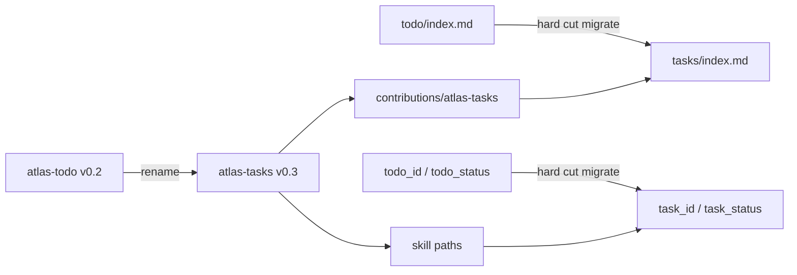

## Intent

Rename the distributed Atlas task discipline package from **atlas-todo** to **atlas-tasks** so naming aligns with core OKF `type: task`. Move the on-disk overlay surface from `todo/` to `tasks/`, rename pointer fields `todo_id` → `task_id` and `todo_status` → `task_status`, publish as breaking **v0.3.0** with documented migrate steps and **no** legacy read shim. Do **not** change `depends_on` behaviour in this release.

## Change-class

`new-surface`

## work_id

`2026-09-29-atlas-todo-rename-atlas-tasks` (inherited; validated)

## Discuss orbit

`work/2026-09-29-atlas-todo-rename-atlas-tasks/` (hub + pins)

## Objective

Rename implemented in the package (v0.3.0); Autogenesis work → `done`; experience recorded. Repository rename, tag and consumer migrate note are separate, maintainer-approved release steps.

## Scope (implement only after explicit approval)

1. **Package identity**
   - `apm.yml` / `SKILL.md` `name:` → `atlas-tasks`
   - `version:` → `0.3.0`
   - Description / triggers: prefer “tasks” language; keep discoverability aliases for “todo” only as trigger phrases if useful, not as package id
2. **Contribution / overlay**
   - Move `contributions/atlas-todo/` → `contributions/atlas-tasks/`
   - `contribution_id` / claimed folder → `tasks` (`tasks/index.md`)
   - `SCHEMA.overlay.json` note updated; still empty `templates.by_type` (no core `task` redeclaration)
3. **Skill paths & docs**
   - Rewrite all path modules, README, CHANGELOG, scenarios, smoke-check for `tasks/`, `task_id`, `task_status`
   - Add **migrate** path (or section under help/getting-started): rename folder, rewrite frontmatter keys, retarget install pin, compile green
4. **GitHub**
   - After package content lands on `main` as `atlas-tasks` identity (may land while repo still named `atlas-todo`), run `gh repo rename atlas-tasks` (or GitHub Settings rename)
   - Update `atlas-mesh.json` store id to `github.com/sergio-sisternes-epam/atlas-tasks`
   - Tag **`v0.3.0`**; run release workflow; consumers install `sergio-sisternes-epam/atlas-tasks#v0.3.0`
5. **Installed copies**
   - Replace any installed `atlas-todo` copy with `atlas-tasks` (retire the old install; no side-by-side install)
6. **Evaluation**
   - Update `scripts/smoke-check.sh` for new ids/paths/keys
   - Add `references/scenarios/atlas-tasks-adversarial-v1.yaml` (keep prior atlas-todo adversarial files as historical)
7. **Consumer migrate note (post-publish)**
   - Tell consumer Atlases to run the migrate path and retarget the package install; **out of product scope for depends_on fixes**

## Non-goals

- Any change to `depends_on` / derived-blocked semantics (deferred post-v0.3.0 per pin)
- Read shim for `todo/`, `todo_id`, or `todo_status`
- Renaming core OKF type `task`
- Cross-Atlas hierarchy/deps expansion
- Autogenesis fusion into runtime
- Implementing in this design operation

## Genesis Artifacts

### Intent + scope + non-goals

See above. Cost stance: **lean** — mechanical rename + smokes; no panel fan-out.

### Component diagram (mini-genesis)



### Interface sketch

- Install: `sergio-sisternes-epam/atlas-tasks#v0.3.0`
- Mount: contribution `atlas-tasks` claims `tasks/`
- Pointer contract (skill-enforced on `type: task`): `task_id`, `task_status`, `body_path`, `related_node`, plus unchanged v0.2 relationship fields (`assignees`, `parent`, `sub_tasks`, `depends_on`) with docs referring to `task_id` values
- Migrate: one-shot operator steps; fail closed if `todo/` remains without `tasks/`

### Cost note

Single implement PR + repo rename + tag; smoke runtime seconds; no multi-agent review required for rename.

## SOLID principles for skills

| Principle | Status | Rationale / design consequence |
|---|---|---|
| S | applicable | Package remains one cohesive responsibility: distributed Atlas **task** discipline. Rename clarifies that responsibility vs “todo” slang. |
| O | applicable | Breaking semver closes accidental dual-path semantics; extension remains via skill paths + overlay claim, not silent aliases. |
| L | not-applicable | No claim that `atlas-todo` and `atlas-tasks` are interchangeable installs after v0.3.0. |
| I | applicable | Progressive disclosure stays path-based; migrate path is additive disclosure for the break. |
| D | applicable | Depend on OKF `task` + Atlas mount contracts; GitHub rename is delivery mechanics, not a new runtime dependency abstraction. |

## Catalogue Review

`pattern_applicability: not-applicable` — rename/identity cut, not topology/gate/fan-out redesign.  
`pattern_admission: not-selected`  
`catalogue_review: n/a` — pure package identity + path/folder rename; no Enter/Exit discipline change beyond migrate documentation.

Composition mode remains **INLINE** on the existing HYBRID root skill (no new S8 split).

## Challenge summary (think-challenge gate)

Grounded / design counters evaluated:

1. **GitHub rename mid-flight breaks clone URLs / mesh** → **accept / pin**: sequence content rename first (or same PR), then `gh repo rename`; mesh id update in same release train; discuss pin already keeps pre-rename Atlas id until rename lands.
2. **Hard cut strands consumer Atlases** → **accept / pin**: documented migrate; post-publish consumer migrate note; no shim (maintainer pin).
3. **Partial rename (folder without field keys) leaves half-broken pointers** → **accept / pin**: smokes require `tasks/` claim + `task_id`/`task_status` keys together; migrate checklist covers both.
4. **Scope creep into depends_on fix** → **accept / pin**: rename-only fence; adversarial smoke expects depends_on docs/semantics unchanged from v0.2 aside from id field rename in prose.
5. **Packaging stub assets remain thin on Release** → **reject as blocker for this plan**: known v0.2 caveat; out of rename scope unless trivial to keep working; git-tag install remains canonical.

## Pinned decisions

1. Package + repo → `atlas-tasks`
2. Overlay `todo/` → `tasks/` (+ `tasks/index.md`)
3. Discuss Atlas id stays `…/atlas-todo` until GitHub rename; then `…/atlas-tasks`
4. Hard cut at v0.3.0 — no `todo/` / old-key read shim; document migrate
5. `todo_id` → `task_id`
6. `todo_status` → `task_status` (enum unchanged)
7. v0.3.0 rename-only — defer the consumer-reported depends_on problem to a later release

## Challenge-success criteria

- **C1** non-trivial counters present (GitHub rename, hard-cut stranding, partial rename, scope creep)
- **C2** high-severity items pinned or rejected with rationale
- **C3** pins visible above
- **C4** scope intact (rename-only)
- **C5** no implementation in this operation
- change-class `new-surface` stated; Genesis Artifacts complete for mini-genesis

## Behavioural contract (agent-spec)

`deferred: agent-spec not available in harness; Gherkin deferred`  
Forbidden behaviours protected by deterministic smokes instead: no `todo/` claim; no `todo_id`/`todo_status` as required keys; no depends_on semantic rewrite.

## Evaluation plan

### Deterministic smokes (primary)

| Check | Expect |
|---|---|
| `apm.yml` / SKILL name | `atlas-tasks`, version `0.3.0` |
| Contribution path | `contributions/atlas-tasks/` exists; old `contributions/atlas-todo/` absent |
| Overlay | `contribution_id: atlas-tasks`; claims `tasks/` |
| Frontmatter keys in docs/smokes | `task_id`, `task_status` present; required-contract samples omit `todo_id`/`todo_status` |
| smoke-check.sh | exit 0 on package root |
| Adversarial v1 | red if skill still claims `todo/` or requires `todo_id` |

### Agent evaluations (secondary)

Optional post-migrate list on a sample Atlas — not sole evidence.

## Adversarial scenario draft

File (implement creates): `references/scenarios/atlas-tasks-adversarial-v1.yaml`

```yaml
id: atlas-tasks-adversarial-v1
work_id: 2026-09-29-atlas-todo-rename-atlas-tasks
packages: [atlas-tasks]
adversarial: true
smokes:
  - id: no-todo-folder-claim
    source: hard-cut-pin
    expect: overlay claims tasks/ only; todo/ absent from contribution
  - id: no-todo_id-key
    source: task_id-pin
    expect: contract samples and smoke frontmatter use task_id not todo_id
  - id: no-todo_status-key
    source: task_status-pin
    expect: contract uses task_status; enum unchanged
  - id: depends_on-semantics-frozen
    source: rename-only-pin
    expect: no new depends_on behaviour beyond id field rename in docs
```

## Implement sequence (after approval)

1. Product PR on `main`: rename package contents + version 0.3.0 + smokes + migrate docs + mesh id prep
2. Merge; refresh installed copies
3. `gh repo rename atlas-tasks` (maintainer-approved step)
4. Tag `v0.3.0`; confirm release / git-tag install
5. Consumer Atlases migrate via the documented migrate path
6. Autogenesis lineage: plan → implemented; work → done; experience recorded; lineage lands on the `atlas` branch

## Implement receipt

Product change: the v0.3.0 rename implementation on branch `implement/2026-09-29-atlas-todo-rename-atlas-tasks` → `main` (pre-publication history).

Implement stopped before the irreversible steps, which were left to the maintainer: repository rename to `atlas-tasks`, tag `v0.3.0`, consumer migrate note, and the Atlas store id update after the rename.

## Invocation receipt (implement)

```text
skill: autogenesis
operation: implement
mode: run
subject: atlas-todo → atlas-tasks rename
work_id: 2026-09-29-atlas-todo-rename-atlas-tasks
change_class: new-surface
atlas_id: github.com/sergio-sisternes-epam/atlas-tasks
ref: atlas
atlas_root: <atlas-root>
plan_path: autogenesis/plans/2026-09-29-atlas-todo-rename-atlas-tasks.md
discuss_orbit: work/2026-09-29-atlas-todo-rename-atlas-tasks/
product_change: v0.3.0 rename implementation (pre-publication history)
behavioural_contract: deferred: agent-spec not available in harness; Gherkin deferred
result.disposition: implemented (repository rename, tag and consumer migrate note deferred to maintainer)
```
