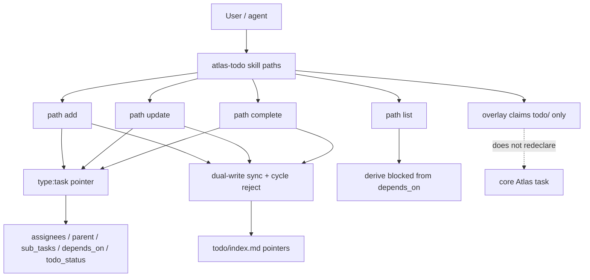

## Intent

Extend the **atlas-todo** skill so TODO task pointers can carry multi-assignee ownership, parent/child hierarchy with dual-write sync, `depends_on` dependencies with derived blocked semantics, and a four-value `todo_status` enum including `in_progress`. Duplicates are modelled as `cancelled` plus `relates_to` the surviving TODO. Skill paths (**add** / **update** / **list** / **complete** / query) enforce sync and validation. Overlay remains a `todo/` claim only; fields stay skill-enforced on `type: task`.

## Change-class

`new-surface`

## work_id

`2026-09-29-atlas-todo-task-relations` (inherited; validated)

## Discuss orbit

`work/2026-09-29-atlas-todo-task-relations/` (hub + pin-*.md)

## Objective

Design the atlas-todo skill/package extension for task relationships and status using locked discuss pins; persist this plan; set work status to `designed`; stop for approval — no implement.

## Scope (implement only after explicit approval)

1. Update skill-enforced frontmatter contract on `type: task` pointers (contribution README + path modules):
   - `assignees: []` (human handles or agent path-slugs; self allowed; never singular `assignee`)
   - `parent` (at most one) + `sub_tasks: []` on parent; skill dual-writes and keeps sync; cycles forbidden
   - `depends_on: []` of `todo_id`; `blocked_by` is prose-only, not a stored field
   - derived blocked when any `depends_on` target is non-terminal (`open` | `in_progress`); no `todo_status: blocked`; no separate boolean
   - `todo_status`: `open` | `in_progress` | `done` | `cancelled`
   - duplicate = `cancelled` + `relates_to` surviving TODO (not a fifth status)
   - retain v1: `todo_id`, `body_path`, `related_node`
2. Composition **INLINE** on existing atlas-todo skill paths: **add** / **update** / **list** / **complete** (and query via list) gain sync + validation steps; help/getting-started mention new fields.
3. Contribution README / overlay docs: document new fields; overlay `SCHEMA.overlay.json` stays `claimed_folders: ["todo"]` with empty `templates.by_type` (no core `task` redeclaration).
4. Index contract: optional compact columns for assignees, parent, depends_on, derived blocked — pointer rows only.
5. Deterministic smokes + adversarial scenario file bump to `atlas-todo-adversarial-v2.yaml` (keep v1).
6. Persist implement lineage back to this plan / work nodes.

## Non-goals

- New fifth status for duplicate or blocked
- Overlay SCHEMA redeclaring core `task`
- Replacing core Atlas task type
- Auto-wiring Autogenesis fusion into atlas-todo runtime
- Changing consumer Atlases in this design
- Cross-Atlas parent or `depends_on` targets (same-Atlas only in this cut)
- Implementing in this design operation

## Genesis Artifacts

### Intent + scope + non-goals

See Intent / Scope / Non-goals above. Cost stance: **balanced**, instruction-first; no panel fan-out; deterministic frontmatter/sync checks preferred over multi-agent synthesis.

### Component diagram (mini-genesis: one mermaid)



### Interface sketch

| Surface | Inputs | Outputs / effects | Blockers |
|---|---|---|---|
| add | atlas id, title, related_node; optional assignees, parent, depends_on | pointer + body + index; dual-write parent/sub_tasks | missing Atlas; cycle; unknown parent/depends_on target |
| update | atlas id, todo_id; field patches | sync both hierarchy ends; refresh index; recompute derived blocked on list | conflict/drift; cycle; singular assignee key |
| complete | atlas id, todo_id | set `done`; keep relations; refresh index | unknown todo_id |
| list | named Atlas(es) | pointer rows + derived blocked column | silent foreign Atlas |
| overlay docs | n/a | field table updated; still `todo/` only | any SCHEMA attempt to redeclare task |

### Cost note

Single-agent path routing. Extra IO: when hierarchy or depends_on changes, read/write the other end of the dual-write and validate targets — still O(neighbours), not a full-store scan on every list. No mandatory multi-model panels.

### Acceptance (for implement Exit)

- Smokes in Evaluation plan green
- Discuss pins reflected in SKILL pins / path modules / contribution README
- Overlay still claims `todo/` only; compile green on fixture
- Plan status → `implemented`; work nodes → `done`
- No Autogenesis runtime fusion; no fifth status; no `todo_status: blocked`

### Stop-for-approval

**Implemented** after explicit maintainer approval of this plan on 2026-09-29. See `experiences/2026-09-29-atlas-todo-task-relations-implement.md`.

## SOLID principles for skills

| Principle | Status | Rationale / design consequence |
|---|---|---|
| S | applicable | atlas-todo keeps one user-facing responsibility: distributed TODO ops. Relationship/status fields extend that surface INLINE on existing paths rather than spawning a second skill. Change pressure is the pointer contract + path sync, not a new product. |
| O | applicable | Core `task` and overlay claim (`todo/` only) stay closed to accidental drift; extension is governed skill-enforced frontmatter + path procedures, versioned with this plan. |
| L | not-applicable | No interchangeable substitute claimed (atlas-todo is not swapping for another TODO skill under a shared contract in this cut). |
| I | applicable | Progressive disclosure: callers of list need derived blocked and compact columns without loading dual-write internals; write paths load sync rules; help stays explain-only. Interface still carries Atlas authority and fail-closed blockers. |
| D | applicable | Depend on Atlas mount/compile and the skill-enforced pointer contract, not harness-specific storage. Dual-write is skill procedure over OKF pages, not a new provider-specific graph DB. |

## Pinned decisions (from discuss)

1. **Ownership:** `assignees: []` — list of human handles or agent path-slugs; self allowed. Not singular `assignee`.
2. **Hierarchy:** dual-write `parent` (one parent) + `sub_tasks` on parent; skill keeps sync; cycles forbidden.
3. **Dependency:** canonical `depends_on: []`; `blocked_by` is prose-only, not a stored field.
4. **Blocked:** derived when any `depends_on` target is still non-terminal (`open` \| `in_progress`); no `todo_status: blocked`; no separate boolean.
5. **Status enum:** `open` \| `in_progress` \| `done` \| `cancelled`.
6. **Duplicate:** `cancelled` + `relates_to` the surviving TODO (not a fifth status).
7. **Still from v1:** `todo_id`, `body_path`, `related_node`. Overlay claims `todo/` only; fields are skill-enforced on `type: task` (Atlas forbids overlay redeclaration of core task).

## Catalogue Review

Topology/path changes are **in scope** (existing path modules gain sync/validation steps).

- **genesis matches:** uses / refines mini-genesis for `new-surface` (intent+scope+non-goals; one mermaid; interface; cost; acceptance; stop-for-approval). No A1 PANEL / B1 fan-out — single-thread path routing remains correct (lens count = 1).
- **Autogenesis extension matches:** B17 ACTIVATION CARD already required by atlas-todo activation path — retain; no new Autogenesis runtime injection. `autogenesis:S8` considered for path modules.
- **composition mode:** **INLINE** on existing atlas-todo skill paths (add/update/list/complete sync). No new LOCAL SIBLING skill. Overlay remains packaged EXTERNAL mount onto user-named Atlas. Core `task` remains EXTERNAL dependency.
- **inherited anti-patterns:** inventing parallel TODO type; silent foreign-store writes; Autogenesis fusion by default; SCHEMA redeclaration of core task; soft-only evaluation of sync invariants.
- **delta only:** relationship/status fields + path sync/validation + index column extensions + smoke/adversarial bump.
- **pattern_applicability:** `applicable` for existing path-module shape (B17 cards already present); S8 parent-routed leaf **not required** for this cut because paths stay instruction modules inside one skill.
- **pattern_admission:** `not-selected` for promoting S8 or splitting a relations skill — would be premature split (R2 fuse pressure: relations content always loads with TODO paths).
- `catalogue_review: complete`

## Behavioural contract (agent-spec)

deferred: agent-spec not available in harness; Gherkin deferred

When specify later runs, protect at least: `@forbidden` invent `todo_status: blocked`; `@forbidden` store `blocked_by` as a field; `@forbidden` accept singular `assignee`; `@forbidden` create hierarchy cycles; `@forbidden` redeclare core `task` in overlay; `@critical` dual-write stays consistent after add/update.

## Evaluation plan

### Deterministic smokes (primary)

1. **Frontmatter keys** — fixture pointer may carry `assignees`, `parent`, `sub_tasks`, `depends_on`, `todo_status`, plus v1 `todo_id` / `body_path` / `related_node`; smoke asserts keys present/absent as contracted.
2. **Status enum** — accept only `open` \| `in_progress` \| `done` \| `cancelled`; reject any other value (including `blocked`, `duplicate`).
3. **Dual-write sync** — setting `parent` on child updates parent's `sub_tasks` and vice versa; both ends match after add/update.
4. **Cycle reject** — A→B→A (or longer) fails closed; no partial write left divergent.
5. **depends_on derivation** — list/index marks derived blocked iff any `depends_on` target is `open` or `in_progress`; terminal (`done`/`cancelled`) targets clear the block.
6. **No blocked status** — contribution README / SKILL / paths never advertise `todo_status: blocked` or a stored `blocked` boolean; smoke greps contract docs + rejects enum.
7. **Overlay claim** — `SCHEMA.overlay.json` still `claimed_folders: ["todo"]` and does not declare `templates.by_type.task`.
8. **Singular assignee regression** — paths/docs reject or never write singular `assignee`; only `assignees` list.
9. **depends_on on cancelled target** — cancelled dependency does not keep derived blocked (terminal).
10. **Orphan sub_tasks** — update that removes child from parent (or clears parent) cleans the other end; orphan `sub_tasks` entries fail closed or are repaired by skill sync.

Smoke count: **10** deterministic checks (implement may fold into `scripts/smoke-check.sh` + scenario YAML).

### Agent evaluations (secondary)

Optional later: agent updates hierarchy without inventing `blocked_by` field or fifth status.

## Adversarial scenario draft

Filename on implement (new file; keep v1): `references/scenarios/atlas-todo-adversarial-v2.yaml`

Full portable draft:

```yaml
version: 1
id: atlas-todo-adversarial-v2
capability: atlas-todo
adversarial: true
work_id: 2026-09-29-atlas-todo-task-relations
packages:
  - atlas-todo
smokes:
  - id: cycle-creation
    command: "bash .apm/skills/atlas-todo/scripts/smoke-check.sh . --check cycle-reject"
    expect: "fail-closed: hierarchy cycle"
    source: "challenge: dual-write drift / ADO one-parent invariant (public ADO migration-tool report; Microsoft Parent/Child)"
  - id: orphan-sub-tasks
    command: "bash .apm/skills/atlas-todo/scripts/smoke-check.sh . --check orphan-sub-tasks"
    expect: "fail-closed-or-repaired: orphan sub_tasks"
    source: "challenge: dual-write without single writer leaves orphans (named theory: consistency under dual-write)"
  - id: blocked-as-status
    command: "bash .apm/skills/atlas-todo/scripts/smoke-check.sh . --check no-blocked-status"
    expect: "reject todo_status:blocked; derived only"
    source: "challenge: blocked-as-status regresses pin (public agile guidance on blocked as a flag; discuss pin-blocked-derived)"
  - id: singular-assignee-regression
    command: "bash .apm/skills/atlas-todo/scripts/smoke-check.sh . --check assignees-list"
    expect: "reject singular assignee; assignees list only"
    source: "challenge: singular assignee regression vs pin-assignees-list / GitHub multi-assignee"
  - id: depends-on-cancelled-target
    command: "bash .apm/skills/atlas-todo/scripts/smoke-check.sh . --check depends-on-terminal"
    expect: "not-blocked when depends_on target cancelled"
    source: "challenge: terminal deps must clear derived blocked (ADO predecessor + pin-blocked-derived)"
happy_path:
  - id: relations-sync-enum-overlay
    command: "bash .apm/skills/atlas-todo/scripts/smoke-check.sh ."
    expect: "ALL SMOKES GREEN"
```

Draft location in plan: this section (body). Implement writes the YAML file under the package scenarios path without dropping v1 smokes.

## Challenge summary

Grounded via catalog think-challenge + light web search + discuss research already on orbit.

| Counter | Severity | Disposition |
|---|---|---|
| Dual-write parent/`sub_tasks` drifts or orphans under partial updates (tracker sync failures; ADO one-parent errors) | high | **Accepted** — skill owns sync; fail closed on conflict/cycle; smoke cycle-creation + orphan-sub-tasks |
| Agents reintroduce `todo_status: blocked` despite derived pin (common Jira anti-pattern) | high | **Accepted** — pin + enum smoke + adversarial blocked-as-status; docs forbid stored boolean |
| Singular `assignee` regresses multi-owner pin | high | **Accepted** — paths reject singular key; smoke singular-assignee-regression |
| Cancelled/`done` dependency still treated as blocking | medium | **Accepted** — terminal clears derived blocked; smoke depends-on-cancelled-target |
| Split a separate “relations” skill or promote S8 modules now | low | **Rejected** — premature split; INLINE composition; pattern_admission not-selected |
| Store both `depends_on` and `blocked_by` fields “for clarity” | medium | **Rejected** — violates pin; `blocked_by` remains prose-only |
| External (non-depends_on) impediments need a blocked status | medium | **Rejected for this cut** — out of scope / non-goal; may later use body note or a future field without enum growth; cite discuss non-goals |

Counters accepted: 4 · rejected: 3 · modified: 0

## Challenge-success criteria (C1–C5)

| Gate | Result |
|---|---|
| C1 non-trivial counters | **pass** — dual-write drift, blocked-as-status, singular assignee, terminal deps |
| C2 high-severity pinned or rejected with rationale | **pass** — three high accepted into pins/smokes; premature split rejected |
| C3 visible pins | **pass** — ## Pinned decisions |
| C4 scope intact | **pass** — non-goals hold; same-Atlas relations only |
| C5 no implementation in this operation | **pass** — plan + work status only |
| change-class stated | **pass** — `new-surface` |
| Genesis Artifacts complete for mini-genesis | **pass** |

## Exact implement scope

See Scope bullets 1–6. Touch only atlas-todo package skill paths, contribution README/overlay docs, smoke script, and new adversarial v2 scenario. Do not mutate foreign Atlases; product changes and Atlas lineage changes are delivered separately (product on `main`, lineage on the `atlas` branch).

## Wait-for-approval

**Closed:** approved and implemented. Experience: `experiences/2026-09-29-atlas-todo-task-relations-implement.md`.
