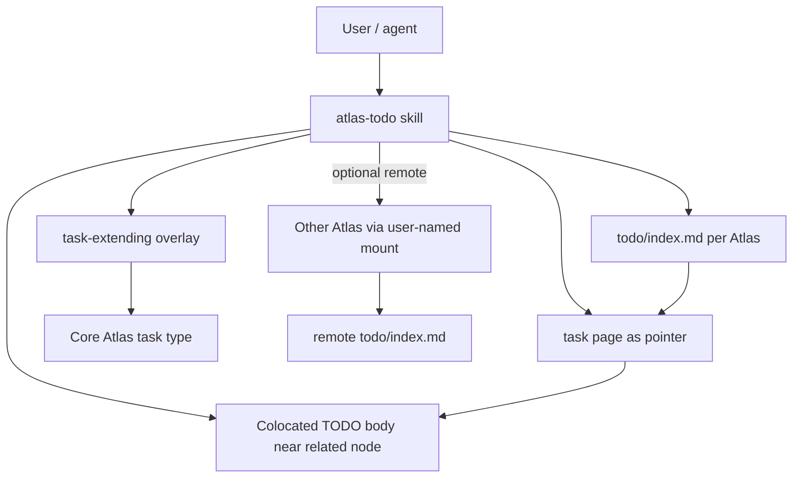
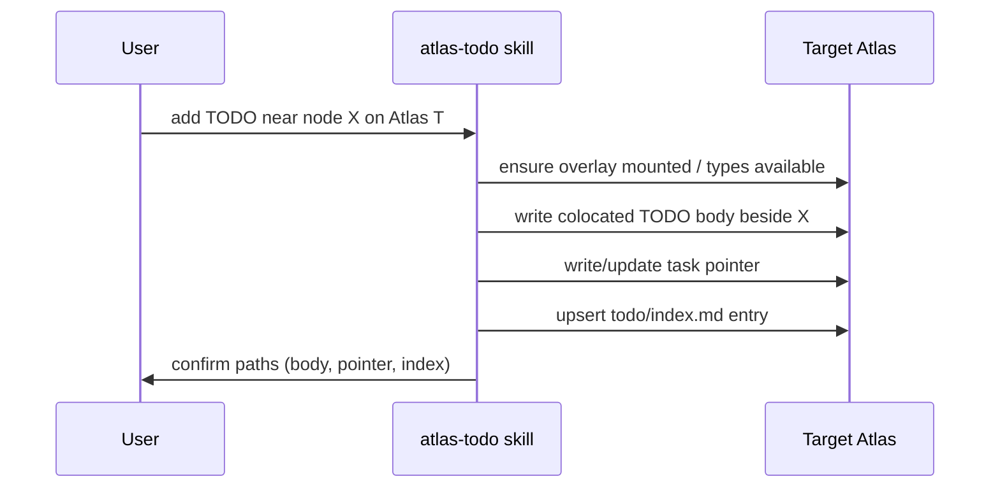

## Intent

Ship **atlas-todo** as a new APM skill package with a dedicated Atlas overlay that **extends core `task`**, so agents can coordinate TODOs across Atlases via per-store `todo/index.md`, with TODO bodies colocated next to related knowledge nodes and `task`/index acting as pointers.

## Change-class

`new-skill`

## Scope (implement only after explicit approval)

1. **APM package layout** on `main` of the package repository (`sergio-sisternes-epam/atlas-todo` at the time; renamed `atlas-tasks` in v0.3.0):
   - Root `apm.yml` (already inited; keep empty deps unless overlay packaging requires otherwise)
   - `.apm/skills/atlas-todo/` (or HYBRID root `SKILL.md` if single-skill — prefer `.apm/skills/atlas-todo/` for room to grow)
   - Overlay artifact(s) installable / mountable onto a user-named Atlas
2. **Overlay** extending core Atlas/`task` (fields for distribution, colocation pointers, index membership) — do not invent a parallel type family that replaces `task`
3. **Skill paths** (instruction modules) at minimum:
   - help / getting-started
   - add / update / complete a TODO (creates colocated body + pointer + index entry)
   - list / query across local index (and, when configured, remote Atlas pointers)
   - mount-overlay (onto Atlas the user indicates)
4. **Per-Atlas `todo/index.md`** contract documented and enforced by skill procedure (create if missing)
5. **README** consumer path: install APM package → mount overlay on indicated Atlas
6. **Scenarios / deterministic smokes** under `references/scenarios/` as listed in Evaluation plan
7. Persist implement lineage back to this plan / work node

## Non-goals

- Autogenesis fusion / copying Autogenesis invocation protocol into atlas-todo runtime
- Replacing existing `task` pages or APM HITL queues wholesale
- Writing into the design-discussion Atlas or any Atlas the user did not name
- Full cross-Atlas realtime sync protocol in v1 (pointers + indexes first)
- Implementing in this design operation

## Discuss pins (inputs)

1. Distributed = each Atlas has `todo/index.md`; TODOs live local or remote; agents coordinate across Atlases
2. New skill + overlay
3. Build on core `task`; overlay extends; complement not replace
4. Install APM package; mount overlay on user-indicated Atlas
5. TODO bodies colocated with related Atlas nodes; `task`/index are pointers

## Genesis Artifacts

### Intent + scope

See Intent / Scope / Non-goals above. Cost stance: instruction-first skill; no panel fan-out in v1; deterministic file/Atlas checks preferred over multi-agent synthesis.

### Component diagram

### Sequence diagram (add TODO)

### Composition decision

| Box | Mode | Rationale |
|---|---|---|
| atlas-todo skill | LOCAL package in this repo | Subject is the package |
| Overlay | Packaged with skill; mounted onto user-named Atlas | Pin: install package then mount overlay where indicated |
| Core task | EXTERNAL dependency on Atlas/OKF task contract | Pin: extend, do not replace |
| Autogenesis / genesis | Authoring only | Not a runtime dep of derived skill |

### Cost stance

v1 is single-agent, path-routed, file/Atlas CLI heavy. No mandatory multi-model panels. Remote coordination is explicit mount + index read, not continuous mesh chatter.

### Interface sketch (skill)

- **Triggers:** atlas-todo, todo index, add todo, list todos, mount todo overlay, distributed todo
- **Inputs:** target Atlas id (required for write/mount), related node path (for colocation), TODO title/body, optional remote Atlas ids for list
- **Outputs:** created/updated paths; index diff; compile result when store changed
- **Authority:** no writes outside user-indicated Atlas; no Autogenesis implement from this skill
- **Blockers:** missing overlay on target; compile red; ambiguous target Atlas

## SOLID principles for skills

| Principle | Status | Rationale / design consequence |
|---|---|---|
| S | applicable | Skill owns distributed TODO ops (index + colocation + pointers). Overlay owns type extension. Separate change pressures. |
| O | applicable | Core `task` contract stays stable; overlay is the governed extension point. |
| L | not-applicable | No interchangeable substitute claimed for atlas-todo vs another TODO skill in v1. |
| I | applicable | Progressive disclosure via path modules; consumers need not load Autogenesis. Mount requires explicit Atlas id. |
| D | applicable | Depend on Atlas mount/compile/`task` contracts, not harness-specific paths; package is APM-portable. |

## Catalogue Review

- genesis matches: uses disciplined skill composition (intent→diagrams→interface); no A1 panel
- Autogenesis extension matches: none required at runtime
- composition mode: LOCAL SIBLING modules under `.apm/skills/atlas-todo/` (instruction-first); EXTERNAL Atlas/`task`
- inherited anti-patterns: avoid inventing parallel TODO type; avoid silent foreign-store writes; avoid Autogenesis fusion by default
- delta only: distributed index + colocation + overlay mount procedure
- admission note: `pattern_applicability: applicable` for S8-style path modules if paths proliferate; `pattern_admission: draft` — approve before splitting beyond help/add/list/mount
- `catalogue_review: complete` for topology/gate of a new skill

## Pinned decisions (design)

1. Adopt all five discuss pins as normative for implement.
2. v1 overlay **extends** `task`; does not introduce a competing primary TODO type.
3. `todo/index.md` is mandatory per Atlas that uses the discipline; skill creates it when missing on first write.
4. Colocation: TODO body path is beside the related node (same folder or explicit child); pointer + index reference it.
5. Consumer flow: `apm install` this package → skill `mount-overlay` on user-named Atlas only.
6. Runtime does **not** include Autogenesis gates/cards.
7. Behavioural Gherkin deferred until `agent-spec` is available; v1 ships deterministic smokes.

## Challenge notes (think-challenge summary)

| Counter | Disposition |
|---|---|
| Index becomes a dump of full TODO prose | **Accepted** — pin colocation; index holds pointers/metadata only |
| Overlay drifts from core `task` into a parallel type | **Accepted** — pin extend-only; review gate in implement acceptance |
| Agents write into wrong Atlas | **Accepted** — require explicit Atlas id; fail closed if missing |
| Remote coordination without sync protocol is hollow | **Modified** — v1 is pointer/index coordination; full sync is non-goal / later protostar |
| HYBRID single SKILL.md vs `.apm/skills/` | **Pinned** — prefer `.apm/skills/atlas-todo/` for module room |

## Challenge-success criteria

- C1: non-trivial counters above · C2: high-severity pinned · C3: pins visible · C4: scope intact · C5: no implement in this operation · change-class `new-skill` · Genesis Artifacts present

## Behavioural contract (agent-spec)

deferred: agent-spec skill not available in this environment; Gherkin deferred until agent-spec is available or a later design refreshes this section. `@forbidden` intents to protect when specify runs: write without named Atlas; replace core task; dump full bodies into index only.

## Evaluation plan

### Deterministic smokes (primary)

1. Package layout: `.apm/skills/atlas-todo/SKILL.md` exists; `apm.yml` has no `apm-toolkit` dependency
2. Overlay artifact present and documented mount procedure
3. After dry-run fixture: `todo/index.md` exists; entry points at colocated body; `task` pointer page exists
4. `atlas compile` green on fixture Atlas with overlay
5. Negative: attempt write without Atlas id fails closed (script or documented skill check)
6. README states install → mount on user-named Atlas

### Agent evaluations (secondary)

Optional later: agent follows add-TODO path without inventing a foreign store.

### Adversarial scenario draft

Filename (on implement): `references/scenarios/atlas-todo-adversarial-v1.yaml`

| id | smoke | expect | source |
|---|---|---|---|
| no-foreign-write | attempt write without Atlas id | fail closed | challenge: wrong Atlas |
| no-index-dump | add TODO | index entry is pointer not full body | challenge: index dump |
| extend-not-replace | overlay schema | extends task; no rival primary type | challenge: parallel type |

## Acceptance (for implement Exit)

- Smokes 1–6 green
- Discuss pins reflected in SKILL + overlay docs
- Plan status → implemented; work node status → done
- No Autogenesis runtime fusion

## Implementation

Approved by the maintainer on 2026-09-29. Implemented under Autogenesis implement for work_id `2026-09-29-atlas-todo`. Design-review corrections applied at implement time: package layout is a single APM tree (`apm.yml` + `.apm/skills/atlas-todo/`); path names keep **add** (not create), with **add** and **complete** as separate paths; each path opens with an Autogenesis-style activation card. See `experiences/2026-09-29-atlas-todo-implement.md`.
