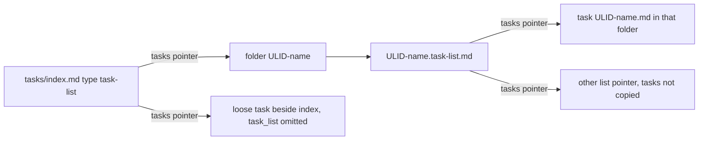

## Intent

Give atlas-tasks a task list that is its own file and folder, linked from the main index, without turning a parent task into a list and without copying member tasks into another list.

## Change-class

`new-surface`

## work_id

`2026-10-04-atlas-tasks-task-lists` (inherited; validated; not renamed)

## Discuss orbit

`discuss/atlas-tasks-task-lists/` linked from this plan. The discuss work node `work/2026-10-04-atlas-tasks-task-lists.md` stays. The canonical Autogenesis work node is `autogenesis/work/2026-10-04-atlas-tasks-task-lists.md`.

## Objective

Approved by the maintainer on 2026-10-04. Implementation authorised for work_id 2026-10-04-atlas-tasks-task-lists.

## Scope (implement only after explicit approval)

1. A task list is a page with `type: task-list`, its own file, and its own folder. A parent task with children is not a list. `parent` and `sub_tasks` stay as they are.
2. `tasks/index.md` is the root task list. It holds other lists and loose tasks. A task that belongs to a specific list is not also a loose row on that index.
3. A task names its list with `task_list` and omits that field when loose. A list names members with `tasks`. Each entry is a pointer to a task or to another list. Not `members`. Not `parent` / `sub_tasks`.
4. A link from one list to another is only a pointer. Tasks are not copied.
5. Navigation is the frontmatter pointer and a mention of that same member in the task-list body.
6. A task list id is a ULID. `task_id` stays `atlas:// <atlas_id>/tasks/<ULID>` for tasks and for task lists. v0.5 identity is not reopened except the filename shape below.
7. Task files and task-list files are named with the ULID first and then a file-safe form of the name. Current ULID-only task files change to this shape. The id remains the ULID.
8. Each non-root task list has a folder named the same way. Tasks in that cluster live in that folder. Loose tasks stay beside `tasks/index.md`, not inside a specific list folder. Where a list folder sits is found only by following pointers from the root task list. No store-wide scan.
9. A non-root list file ends in `.task-list.md`. Task files stay `.md`. Contract is frontmatter `type: task-list`. Compliance checks the suffix against the type, with the root-index exception in Pinned decisions.

## Non-goals

- Implementing, migrating product files, or editing the atlas-tasks skill package in this operation.
- Reopening v0.5 identity, dependency `kind`, assignee, or parent / `sub_tasks`.
- Using a parent task as a list, or copying member tasks into the pointing list.
- Requiring a store-wide scan to discover lists.
- Authoring `.feature` files. agent-spec is not in this agent's skill catalog.
- Adding product tests or scenario files under the skill package during design.
- Committing or pushing.

## Genesis Artifacts

### Intent

Agents and people need a named grouping of tasks that is not a parent task. The grouping is a task-list page the root index points at. Membership is visible in frontmatter and in the list body. Loose tasks remain on the root list only.

### Scope

Storage and schema surface inside atlas-tasks: type `task-list`, fields `task_list` and `tasks`, ULID identity, ULID-plus-name paths, one folder per non-root list, pointer-only links, and compliance checks for suffix, folder membership, and no duplicated loose rows. Skill paths that add, move, rename, and list tasks gain this surface only after approval.

### Non-goals

See Non-goals above. No new skill package. No fan-out, gate, or extension-contract change.

### Diagram



### Interface sketch

The space after `atlas://` in the sketches below is only so this plan page does not look like a live external link to the compiler. The real URI has no space: scheme, atlas id, `/tasks/`, ULID.

Root list, reserved path, sole suffix exception:

```yaml
# tasks/index.md
type: task-list
task_id: atlas:// <atlas_id>/tasks/<ROOT_ULID>
tasks:
  - atlas:// <atlas_id>/tasks/<LIST_ULID>
  - atlas:// <atlas_id>/tasks/<LOOSE_ULID>
```

Non-root list. Folder and file both start with the list ULID. The file ends in `.task-list.md`. Body mentions each `tasks` entry.

```yaml
# <parent>/<LIST_ULID>-<file-safe-name>/<LIST_ULID>-<file-safe-name>.task-list.md
type: task-list
task_id: atlas:// <atlas_id>/tasks/<LIST_ULID>
task_list: atlas:// <atlas_id>/tasks/<ROOT_ULID>
tasks:
  - atlas:// <atlas_id>/tasks/<TASK_ULID>
  - atlas:// <atlas_id>/tasks/<OTHER_LIST_ULID>
```

Task in that cluster. `task_list` is the list URI. The file is `.md`, never `.task-list.md`, and it lives in the list folder.

```yaml
# <parent>/<LIST_ULID>-<file-safe-name>/<TASK_ULID>-<file-safe-name>.md
type: task
task_id: atlas:// <atlas_id>/tasks/<TASK_ULID>
task_list: atlas:// <atlas_id>/tasks/<LIST_ULID>
```

Loose task. Omit `task_list`. File sits in `tasks/` next to `tasks/index.md`.

```text
tasks/<LOOSE_ULID>-<file-safe-name>.md
tasks/<LIST_ULID>-<file-safe-name>/<LIST_ULID>-<file-safe-name>.task-list.md
tasks/<LIST_ULID>-<file-safe-name>/<TASK_ULID>-<file-safe-name>.md
```

Pointer values are `task_id` URIs, not slug paths. The file-safe name is a readable slug after the ULID. It is not the id. A nested list has its own folder; its tasks are not copied into the pointing list. The parent directory of a list folder is whatever the pointer already reached. Default placement for a new list is inside the folder of the list that points at it. The root folder is `tasks/`. Nothing in compliance discovers lists by walking the whole store.

### Cost note

Stance: balanced, kept small. One skill surface, no panel, no sub-agent fan-out, no extra model class. The expensive part is a later migrate of ULID-only task filenames to ULID-plus-name, still one deterministic pass plus the existing skill checks. Token cost of a design read is this plan. Token cost of a later implement is one coding pass over path docs and compliance, not a multi-lens review. No cost cap is set. Halt is approval, not spend.

### Acceptance

- The nine discussion pins below are recorded accepted and are not reopened.
- Interface sketch matches those pins, including URI identity and the root-index suffix exception.
- Evaluation plan names deterministic checks for suffix, type, folder membership, and no duplicated index rows.
- `catalogue_review: n/a`. Behavioural contract is the deferral sentence in that section.
- This operation does not change product skill files.
- Approved 2026-10-04; implement may apply this scope only.

### Stop for approval

Approved 2026-10-04. Gate cleared for implement.

## SOLID principles for skills

| Principle | Status | Rationale / design consequence |
|---|---|---|
| S | applicable | Task lists own grouping and folder membership. Parent and child hierarchy stays a separate relation. A parent with children is not a list, so the two change for different reasons. |
| O | trade-off | `type: task-list`, `task_list`, and `tasks` are closed against accidental synonyms (`members`, `parent`, copied rows). The contract stays open to a later approved version bump. No speculative extension point is added. Competing property: future list kinds. Chosen boundary: one list type until a real second kind exists. |
| L | not-applicable | A task list is not claimed to be substitutable for a task, and a parent task is not a substitute list. Callers must not swap them. |
| I | applicable | Callers see `task_list` or its absence, and `tasks` as pointers. Filename slug, folder placement, and body mention are the storage shape, not extra fields the caller must invent. The root index is the only entry the caller has to open. |
| D | applicable | Membership pointers depend on the stable `task_id` URI, not on the slug in the filename and not on a store-wide directory walk. The skill still writes concrete markdown files. That file layout is the product, not an incidental adapter, so no extra portability layer is introduced. |

## Catalogue Review

`catalogue_review: n/a` — this is schema and storage for task lists and filename rules, not topology, gates, fan-out, or extension contracts.

`pattern_applicability: not-applicable` — no panel, pipeline, or extension composition is selected.

`pattern_admission: not-selected`

## Challenge summary

Grounded counter (search, not internal-only): a human name in the filename makes every title edit a path change. ntropy ADR 0004 (2026-06-24) accepts `<ulid>-<slug>.md` and treats the ULID as identity, resolving `<ulid>-*.md` rather than the full slug path (https://docs.rs/crate/ntropy/latest/source/docs/adr/0004-note-identity-and-filename-strategy.md). ADR 0028 then says a Markdown link whose slug is stale still resolves by the leading ULID, while click-to-open stays broken until an explicit reconcile rewrites the slug (https://docs.rs/crate/ntropy/latest/source/docs/adr/0028-note-to-note-links-as-standard-markdown-links.md). Pyrite records the same failure when a rename does not rewrite wikilinks (https://github.com/markramm/pyrite/commit/bbf3b31d9fb7a02045dd51608020c0c417b4c0fa). Severity: high. A pointer that stores only the current slug path will dangle after a rename, and a store-wide glob would violate the pointer-only entrypoint pin.

Resolution: **modify**. Do not reopen the filename pin. Keep ULID first plus the file-safe name. Keep `task_id` as `atlas:// <atlas_id>/tasks/<ULID>` with no slug in the URI. Frontmatter `task_list` and `tasks` store that URI, not the slug path. A title change renames the file and rewrites body mentions in the same skill write. There is no store-wide scan. Inside a folder already reached by a pointer, a stale filename may be matched by the ULID prefix of that folder's entries only. Out-of-band renames are not silent; an explicit reconcile may realign slugs later.

Second grounded counter, accepted as a check rather than a new pin: both sides of membership drift when two writers update them. A public report from the PageSpace project shows a legacy assignee column and a junction written by separate paths so the two views disagree. Microsoft's dual-write guidance says an integration key must not be a user-editable column, because changing the key changes identity (https://www.loganconsulting.com/blog/dual-write-in-dynamics-365-treat-it-like-a-consistency-contract-not-a-data-pipe/). Resolution: **accept**. One skill write updates `task_list` and the list's `tasks` together. The pointer key is the ULID URI, which the user does not edit as identity. Compliance walks from the root and fails if the two sides disagree. This does not reopen the both-sides pin.

## Pinned decisions

Source: maintainer design discussion, 2026-10-04. Status: accepted. Not reopened.

1. Any task list has its own file, linked from the main index. A parent task with children is not a list.
2. `tasks/index.md` is itself a task list. It holds other lists and loose tasks. A task inside a specific list is not also a loose row on the main index.
3. A task names its list with `task_list`, omitted when loose. A list names members with `tasks`, not `members`. Each entry is a pointer to a task or another list. Not `parent` / `sub_tasks`.
4. A link from one list to another is only a pointer. Tasks are not copied.
5. Navigation is both the frontmatter link and a mention in the task-list body.
6. A task list id is a ULID, like a task. `task_id` stays `atlas:// <atlas_id>/tasks/<ULID>`. v0.5 identity is not reopened except the filename change below.
7. File names for tasks and task lists include the ULID and a file-safe form of the name, ULID first. Current ULID-only task files change to this shape. The id remains the ULID.
8. A task list has its own folder. Tasks in that cluster live in that folder. The folder name is the ULID plus the list name. Loose tasks stay with the main index, not inside a specific list folder. Where the list folder sits is reached only by following pointers from the root task list. No store-wide scan. Read with the existing "anywhere" pin: the cluster folder is required, and its parent directory is not a fixed store location.
9. The list file ends in `.task-list.md`. Task files stay `.md`. Contract is frontmatter `type: task-list`. Compliance checks that a file with that type ends in `.task-list.md` and a task file does not. Consequence of pins 2 and 9, not a reopen: `tasks/index.md` is the only `type: task-list` file allowed to keep the reserved index name.

Challenge pin (modify, see Challenge summary): pointers store the ULID URI; slug renames rewrite the filename and body mentions; ULID-prefix match is allowed only inside a folder already reached by a pointer.

## Challenge-success criteria

C1 met: filename-slug counter is grounded and non-trivial. C2 met: high severity, modified with rationale, both-sides drift accepted as a check. C3 met: pins are visible above. C4 met: scope stays the task-list storage surface. C5 met: no skill implementation in this operation. Change-class `new-surface`. Genesis Artifacts contain intent, scope, non-goals, one mermaid, interface sketch, cost note, acceptance, and stop-for-approval.

## Behavioural contract (agent-spec)

deferred: agent-spec is not in this agent's skill catalog.

agent-spec owns writing and evolving all behavioural Gherkin specifications. Autogenesis supplies the design packet and consumes the resulting contract section plus `b-` IDs, or an explicit deferral. No `.feature` files are authored here. `@forbidden` and `@critical` scenarios are not named because specify did not run.

`behavioural_contract: deferred: agent-spec is not in this agent's skill catalog`

## Evaluation plan

Deterministic smokes are the primary evidence. They were not run in this design operation. Do not treat this section as a pass. Agent narrative is not evidence for these checks. No product tests are added to the skill package here. Implement, after approval, would add `references/scenarios/atlas-tasks-adversarial-v4.yaml` and extend the existing runner. Commands that could run later:

- `bash references/scenarios/smoke-check.sh` from the atlas-tasks skill root, once v4 exists. Not run now.
- A suffix check: every page with `type: task-list` ends with `.task-list.md`, except `tasks/index.md`; every page with `type: task` ends with `.md` and does not end with `.task-list.md`.
- A filename check: task and task-list basenames start with their ULID, then a hyphen, then the file-safe name.
- A folder check: a task whose `task_list` is list L lives in L's folder; a loose task, with `task_list` omitted, lives beside `tasks/index.md` and not inside a specific list folder.
- An index check, by walking pointers from `tasks/index.md` only: a ULID listed in a child list's `tasks` is not also a loose entry on the root `tasks` list.
- A both-sides check on that same walk: the task's `task_list` URI equals the list that points at it, and a list-to-list entry does not duplicate the target list's task URIs.
- `python3 <atlas-skill>/scripts/atlas.py compile --root <subject atlas root>` remains the store gate for this plan page, separate from product smokes.

## Adversarial scenario draft

Future file, not created in this design: `references/scenarios/atlas-tasks-adversarial-v4.yaml`. Prior files stay.

```yaml
id: atlas-tasks-adversarial-v4
work_id: 2026-10-04-atlas-tasks-task-lists
packages: [atlas-tasks]
adversarial: true
smokes:
  - id: task-list-suffix-matches-type
    source: pin-task-list-extension
    expect: type task-list ends in .task-list.md except tasks/index.md; type task does not
  - id: listed-task-not-loose-on-index
    source: pin-main-index-is-a-task-list
    expect: a task URI inside a child list is absent from root tasks
  - id: list-link-does-not-copy-tasks
    source: pin-list-link-is-a-pointer
    expect: a list pointer does not duplicate the target list task URIs
  - id: rename-keeps-ulid-uri
    source: ntropy ADR 0004 and ADR 0028
    expect: title change keeps task_id URI and ULID; slug path is not the id; no store-wide scan
  - id: member-lives-in-list-folder
    source: pin-list-has-own-folder
    expect: task with task_list L is inside L folder; loose task is not
```

## Implement gate

Approved. Implement may proceed for this work_id only; do not widen scope. Do not commit or push from Autogenesis implement.
